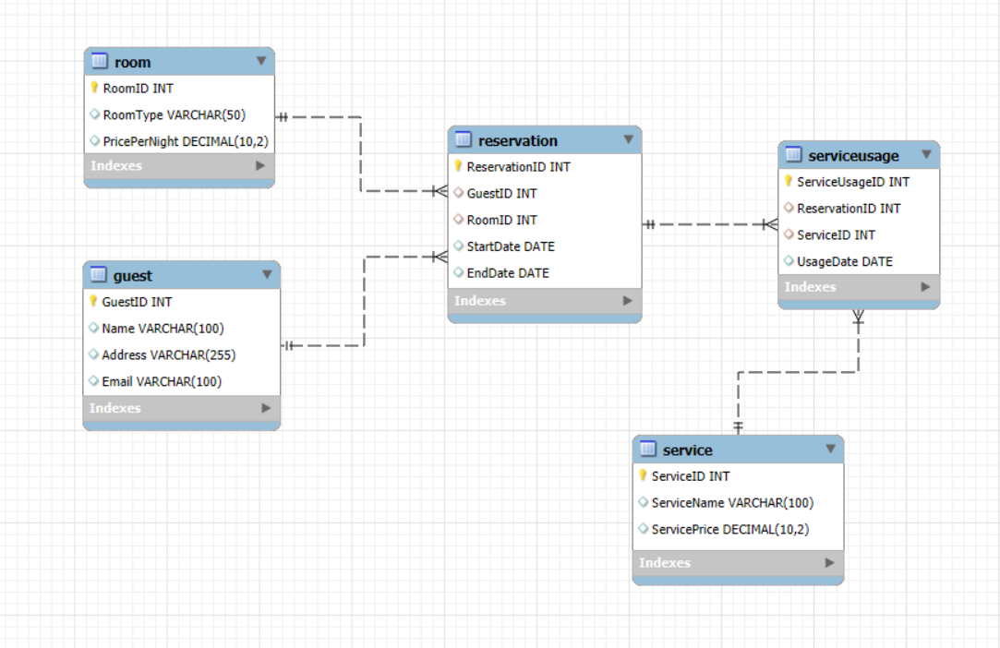

# 1. Mô tả các thực thể và thuộc tính

## Thực thể Guest (Khách hàng):

- GuestID: Khóa chính, định danh duy nhất cho mỗi khách hàng.
- Name: Tên khách hàng.
- Address: Địa chỉ của khách hàng.
- Email: Địa chỉ email của khách hàng.

## Thực thể Room (Phòng):

- RoomID: Khóa chính, định danh duy nhất cho mỗi phòng.
- RoomType: Loại phòng (ví dụ: đơn, đôi, suite).
- PricePerNight: Giá phòng mỗi đêm.

## Thực thể Reservation (Đặt phòng):

- ReservationID: Khóa chính, định danh duy nhất cho mỗi lần đặt phòng.
- GuestID: Khóa ngoại tham chiếu đến Guest(GuestID).
- RoomID: Khóa ngoại tham chiếu đến Room(RoomID).
- StartDate: Ngày bắt đầu đặt phòng.
- EndDate: Ngày kết thúc đặt phòng.

## Thực thể Service (Dịch vụ):

- ServiceID: Khóa chính, định danh duy nhất cho mỗi dịch vụ.
- ServiceName: Tên của dịch vụ (ví dụ: spa, bữa sáng, giặt là).
- ServicePrice: Giá của dịch vụ.

## Thực thể ServiceUsage (Sử dụng dịch vụ):

- ServiceUsageID: Khóa chính, định danh duy nhất cho mỗi lần sử dụng dịch vụ.
- ReservationID: Khóa ngoại tham chiếu đến Reservation(ReservationID).
- ServiceID: Khóa ngoại tham chiếu đến Service(ServiceID).
- UsageDate: Ngày sử dụng dịch vụ.

# Sơ đồ ER

- Guest ←1-n→ Reservation: Một khách có thể có nhiều lần đặt phòng.
- Room ←1-n→ Reservation: Một phòng có thể được đặt nhiều lần (vào các thời điểm khác nhau).
- Reservation ←n-n→ Service thông qua ServiceUsage: Một lần đặt phòng có thể sử dụng nhiều dịch vụ, và một dịch vụ có thể được sử dụng trong nhiều lần đặt phòng khác nhau.

