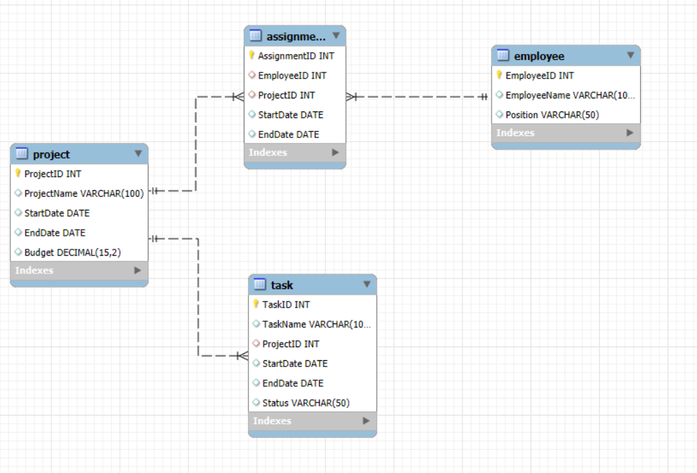

# Mô tả các thực thể và các thuộc tính

## Thực thể Project (Dự án):

- ProjectID: Khóa chính, định danh duy nhất cho mỗi dự án.
- ProjectName: Tên của dự án.
- StartDate: Ngày bắt đầu của dự án.
- EndDate: Ngày kết thúc của dự án.
- Budget: Ngân sách dự kiến cho dự án.

## Thực thể Employee (Nhân viên):

- EmployeeID: Khóa chính, định danh duy nhất cho mỗi nhân viên.
- EmployeeName: Tên của nhân viên.
- Position: Chức vụ của nhân viên.

## Thực thể Assignment (Phân công):

- AssignmentID: Khóa chính, định danh duy nhất cho mỗi phân công.
- EmployeeID: Khóa ngoại tham chiếu đến Employee(EmployeeID).
- ProjectID: Khóa ngoại tham chiếu đến Project(ProjectID).
- StartDate: Ngày bắt đầu của phân công.
  EndDate: Ngày kết thúc của phân công.

## Thực thể Task (Nhiệm vụ):

- TaskID: Khóa chính, định danh duy nhất cho mỗi nhiệm vụ.
- TaskName: Tên của nhiệm vụ.
- ProjectID: Khóa ngoại tham chiếu đến Project(ProjectID).
- StartDate: Ngày bắt đầu của nhiệm vụ.
- EndDate: Ngày kết thúc của nhiệm vụ.
- Status: Trạng thái của nhiệm vụ (ví dụ: "Đang thực hiện", "Hoàn thành").

# Sơ đồ ER

- Project ←→ Assignment ←→ Employee: Mối quan hệ giữa
- Project và Employee là nhiều-nhiều, được quản lý qua bảng liên kết Assignment.
- Project ←1-n→ Task: Mối quan hệ giữa Project và Task là một-nhiều, vì một dự án có thể bao gồm nhiều nhiệm vụ khác nhau.

